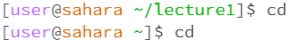
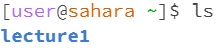
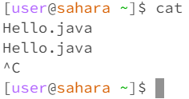

# Lab Report 1
## 1. Example of using the command with no arguments
a)　Using cd command

* **Working Directory**: The working directory was /home/lecture1.
* **Why This Output**: When using this command, it sets the directory to /home. This is why the directory was moved from lecture1 to home, as seen in the screenshot.
* **Error?** : The output is not an error.

b)　Using ls command

* **Working Directory**: The working directory was /home.
* **Why This Output**: When using this command, it shows the files and folders inside the current working directory. This is why the output was lecture1, as seen in the screenshot.
* **Error?** : The output is not an error.

c)　Using cat command

* **Working Directory**: The working directory was /home.
* **Why This Output**: When using this command, it prints the content of null, since there was no argument. This is why the output was null.
* **Error?** : The output is not an error.

## 2. Example of using the command with a path to a directory as an argument
a)　Using cd command

* **Working Directory**: The working directory was /home.
* **Why This Output**: When using this command, it sets the directory to the given directory in the argument, lecture1. This is why the directory was moved from home to lecture1, as seen in the screenshot.
* **Error?** : The output is not an error.

b)　Using ls command

* **Working Directory**: The working directory was /home.
* **Why This Output**: When using this command, it shows the files and folders inside the given directory in the argument, lecture1. This is why the output was , as seen in the screenshot.
* **Error?** : The output is not an error.

c)　Using cat command

* **Working Directory**: The working directory was /home.
* **Why This Output**: When using this command, it prints the content of null, since there was no argument. This is why the output was null.
* **Error?** : The output is not an error.

## 3. Example of using the command with a path to a file as an argument
a)　Using cd command

* **Working Directory**: The working directory was /home/lecture1.
* **Why This Output**: When using this command, it sets the directory to /home. This is why the directory was moved from lecture1 to home, as seen in the screenshot.
* **Error?** : The output is not an error.

b)　Using ls command

* **Working Directory**: The working directory was /home.
* **Why This Output**: When using this command, it shows the files and folders inside the current working directory. This is why the output was lecture1, as seen in the screenshot.
* **Error?** : The output is not an error.

c)　Using cat command

* **Working Directory**: The working directory was /home.
* **Why This Output**: When using this command, it prints the content of null, since there was no argument. This is why the output was null.
* **Error?** : The output is not an error.
