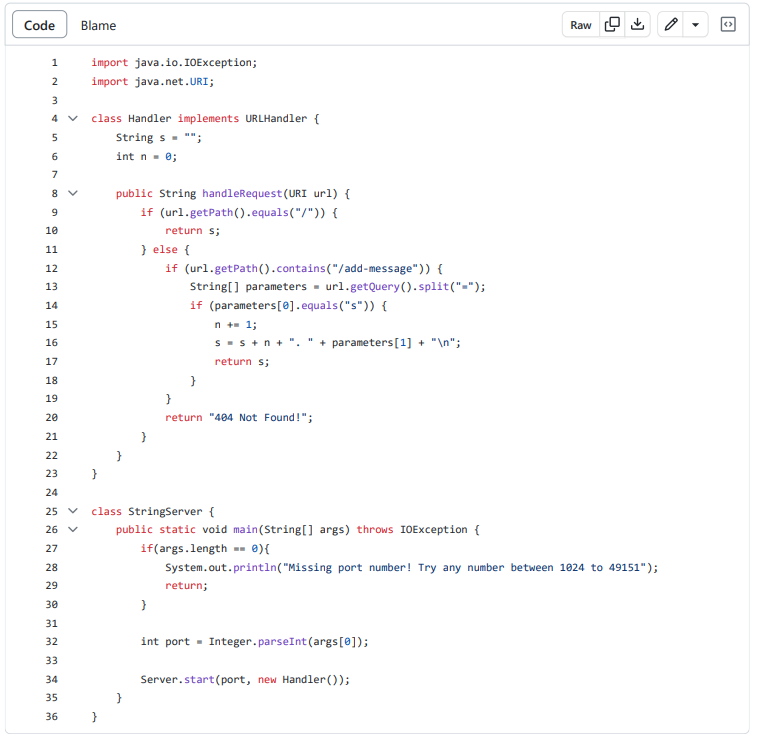

**# Lab Report 1
## 1. Part 1
**1.　My StringServer.java Code**

**2.　Adding "Hello"**

* **Which methods are called?**: The working directory was /home.
* **Relevant arguments/fields?**: When using this command, it shows the files and folders inside the current working directory. This is why the output was lecture1, as seen in the screenshot.
* **How do the relevant fields change?** : The output is not an error.

**3.　Adding "How are you"**

* **Which methods are called?**: The working directory was /home.
* **Relevant arguments/fields?**: When using this command, it shows the files and folders inside the current working directory. This is why the output was lecture1, as seen in the screenshot.
* **How do the relevant fields change?** : The output is not an error.

## 2. Part 2
**1.　The path to the private key**

**2.　The path to the public key**

**3.　A specific terminal interaction**

## 3. Part 3
**What I learned from Week 2 & 3**

The 
