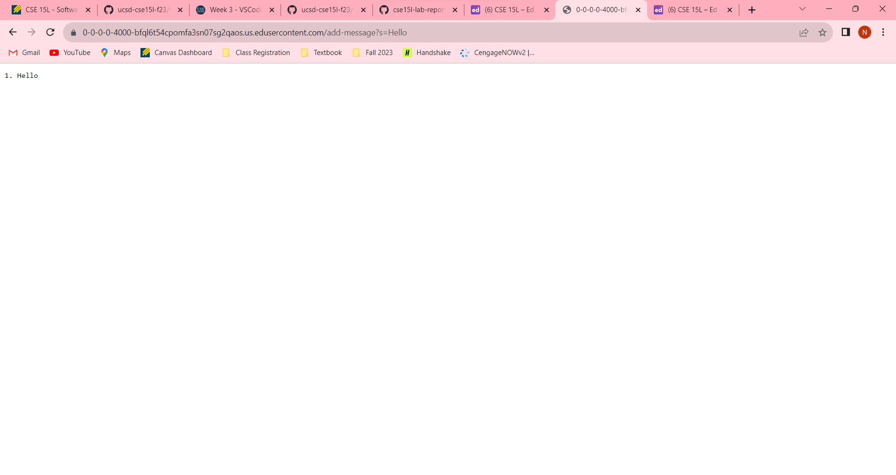

# Lab Report 2
## 1. Part 1
**1.　My StringServer.java Code**

**2.　Adding "Hello"**

* **Which methods are called?**: The method that was called was the handleRequest method.
* **Relevant arguments/fields?**: The relevant values are Integer field n, String field s, and the URI 0-0-0-0-4000-bfql6t54cpomfa3sn07sg2qaos.us.edusercontent.com/add-message?s=Hello.
* **How do the relevant fields change?** : The Integer field n changes from 0 to 1 and the String field s changes from "" to "1. Hello \n".

**3.　Adding "How are you"**

* **Which methods are called?**: The method that was called was the handleRequest method.
* **Relevant arguments/fields?**: The relevant values are Integer field n, String field s, and the URI 0-0-0-0-4000-bfql6t54cpomfa3sn07sg2qaos.us.edusercontent.com/add-message?s=How%20are%20you.
* **How do the relevant fields change?** : The Integer field n changes from 1 to 2 and the String field s changes from "1. Hello" to "1. Hello" in the first line and "2. How+are+you" in the second line.

## 2. Part 2
**1.　The path to the private key**

**2.　The path to the public key**

**3.　A specific terminal interaction**

## 3. Part 3
**What I learned from Week 2 & 3**

The most interesting thing I learned from Week 2 & 3 is how url has parts and each of them has its own meaning. To illustrate, I never knew that the url I have taken for granted has a domain, which is is like the title/owner of the url, path, which specifies the file the url wants to show by going from the parent folder of the file and the parent folder of that folder, query, which is used to assign certain condition of the path, and anchor, which assigns certain part of the webpage. It was intriguing since I know how url works, I am able to make webpages using github which behaves differently depending on the argument of the query. 
