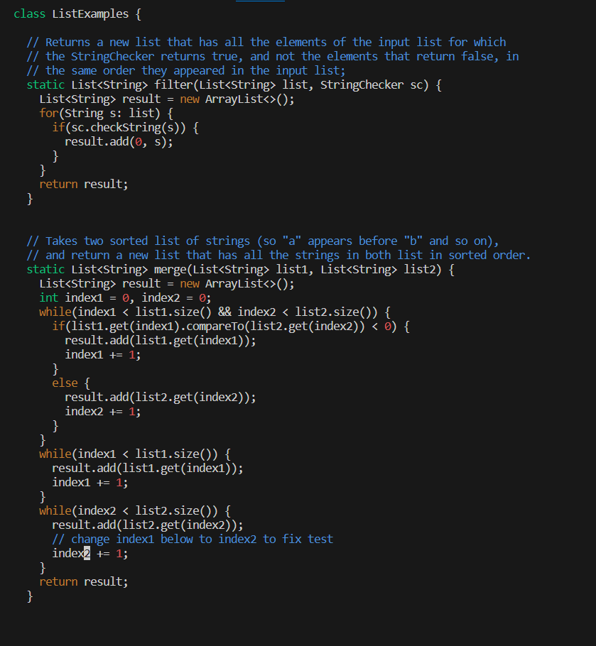
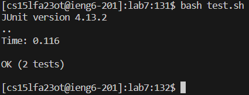

# Lab Report 4
## 1. Step 4

**Key Pressed**: *<up><enter>*

**Why This Input**: The "*ssh cs15lfa23ot@ieng6.ucsd.edu*" command was 1 up in the search history, so I used up arrow to access it.
## 2. Step 5

**Key Pressed**: *<up><up><up><up><up><up><up><up><up><up><up><enter>*

**Why This Input**: The "*git clone git@github.com:ucsd-cse15l-s23/lab7.git*" command was 11 up in the search history, so I used up arrow to access it.
## 3. Step 6

**Key Pressed**: *<up><up><up><up><up><up><up><up><up><up><up><enter>,<up><up><up><up><up><up><up><up><up><enter>*

**Why This Input**: The "*cd lab7*" command was 11 up in the search history, so I used up arrow to access it. Then, the "*bash test.sh*" command was 9 up in the search history, so I used up arrow to access it.
## 4. Step 7

**Key Pressed**: *<up><up><up><up><up><up><up><up><up><up><up><enter>,<x><i><2><esc><:><w>
<enter>*

**Why This Input**: The "*vim ListExamples.java*" command was 11 up in the search history, so I used up arrow to access it. Then, since the cursor was already on the "1" of input1 which I wanted to edit, I used x to delete the character on the cursor, i to change to insert mode, 2 to insert "2", and esc and :wp to save and exit from vim.
## 5. Step 8

**Key Pressed**: *<up><up><enter>*

**Why This Input**: The "*bash test.sh*" command was 2 up in the search history, so I used up arrow to access it.
## 6. Step 9

**Key Pressed**: *<up><up><up><up><up><up><up><up><up><up><up><enter>,<up><up><up><up><up><up><up><up><up><up><up><enter>,<up><up><up><up><up><up><up><up><up><up><up><enter>*

**Why This Input**: The "*git add ListExamples.java*" command was 11 up in the search history, so I used up arrow to access it. Then, the "*git commit -m "Edited ListExamples.java"*" command was 11 up in the search history, so I used up arrow to access it. Finally, "*git push*" command was 11 up in the search history, so I used up arrow to access it.
