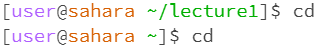
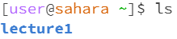

# Lab Report 4
## 1. Example of using the command with no arguments
**1.　Using cd command**

* **Working Directory**: The working directory was /home/lecture1.
* **Why This Output**: When using this command, it sets the directory to /home. This is why the directory was moved from lecture1 to home, as seen in the screenshot.
* **Error?** : The output is not an error.

**2.　Using ls command**

* **Working Directory**: The working directory was /home.
* **Why This Output**: When using this command, it shows the files and folders inside the current working directory. This is why the output was lecture1, as seen in the screenshot.
* **Error?** : The output is not an error.

**3.　Using cat command**

* **Working Directory**: The working directory was /home.
* **Why This Output**: When using this command, it tried to print the content of the file(s) of the argument. Since there was not any argument, the output was nothing and the terminal is waiting for the next input. When something is typed in here, it prints out the input into a new line. This was resolved using 'Ctrl + C'. 
* **Error?** : The output is not an error.

## 2. Example of using the command with a path to a directory as an argument
**1.　Using cd command**

* **Working Directory**: The working directory was /home.
* **Why This Output**: When using this command, it sets the directory to the given directory in the argument, lecture1. This is why the directory was moved from home to lecture1, as seen in the screenshot.
* **Error?** : The output is not an error.

**2.　Using ls command**

* **Working Directory**: The working directory was /home.
* **Why This Output**: When using this command, it shows the files and folders inside the given directory in the argument, lecture1. This is why the output was "Hello.class Hello.java messages README", as seen in the screenshot.
* **Error?** : The output is not an error.

**3.　Using cat command**

* **Working Directory**: The working directory was /home.
* **Why This Output**: When using this command, it tried to print the content of the file(s) of the argument. Since the argument was a directory, it could not print out its content and sent an error message, as seen in the screenshot
* **Error?** : The output is an error because cat is meant to take file(s) as an argument and not a directory.

## 3. Example of using the command with a path to a file as an argument
**1.　Using cd command**

* **Working Directory**: The working directory was /home/lecture1.
* **Why This Output**: When using this command, it sets the working directory to the directory in the argument.Since the argument is a file and not a directory, it sents out an error message, as seen in the screenshot.
* **Error?** : The output an error because the cd is meant to directory/no argument as an argument and not a file.

**2.　Using ls command**

* **Working Directory**: The working directory was /home/lecture1.
* **Why This Output**: When using this command, it shows the files and folders inside the file in the argument. Unlike directories, since there is no files inside a file, the output turned out to be the argument, regardless of the file type or the file path. To illustrate, for Hello.java, "Hello.java" was the output and for Hello.class, "Hello.class" was the output. As for the text file in the messages, for messages/en-us.txt (which is the relative path), "messages/en-us.txt" was the output and for /home/lecture1/messages/en-us.txt (which is the absolute path), "/home/lecture1/messages/en-us.txt" was the output.
* **Error?** : The output is not an error.

**3.　Using cat command**

* **Working Directory**: The working directory was /home/lecture1.
* **Why This Output**: When using this command, it prints the content of the file. This is why all the codes in Hello.java was printed out, as seen in the screenshot.
* **Error?** : The output is not an error.
