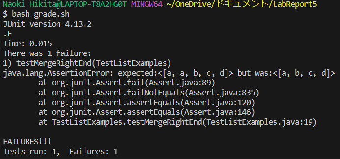
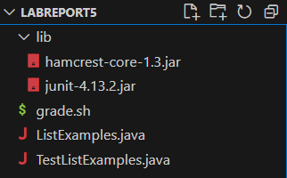
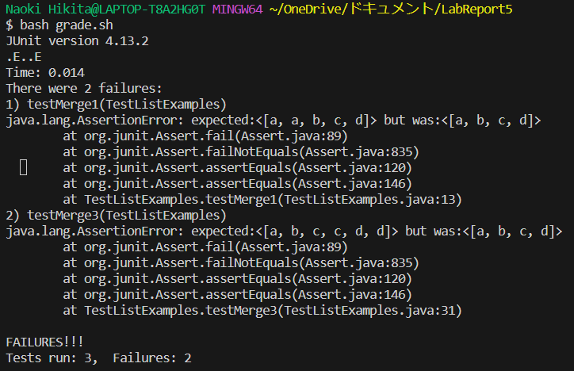

# Lab Report 1
## 1. Debugging Scenario
**1. Student's Post**

Hi, I'm Naoki. While running tests for my ListExample.java, I ran into a symptom in the screenshot below.



From this output, I am guessing that there is no compliation errors, meaning that grade.sh is fine and that I need to fix ListExample.java. To be specific, I think there is an error when adding the first element of either list1 or list2, or the two lists have the same element. I am not sure on what to do from here though.

For your information, these are my file structure and codes for each file.



* **ListExamples.java**
```
import java.util.ArrayList;
import java.util.List;

class ListExamples {
  // Takes two sorted list of strings (so "a" appears before "b" and so on),
  // and return a new list that has all the strings in both list in sorted order.
  static List<String> merge(List<String> list1, List<String> list2) {
    List<String> result = new ArrayList<>();
    int index1 = 0, index2 = 0;
    while(index1 < list1.size() && index2 < list2.size()) {
      int compared = list1.get(index1).compareTo(list2.get(index2));
      if(compared == 0) {
        result.add(list1.get(index1));
        index1 += 1;
        index2 += 1;
      }
      else if(compared < 0) {
        result.add(list1.get(index1));
        index1 += 1;
      }
      else {
        result.add(list2.get(index2));
        index2 += 1;
      }
    }
    while(index1 < list1.size()) {
      result.add(list1.get(index1));
      index1 += 1;
    }
    while(index2 < list2.size()) {
      result.add(list2.get(index2));
      index2 += 1;
    }
    return result;
  }


}
```
* **TestListExamples.java**
```
import static org.junit.Assert.*;
import org.junit.*;
import java.util.Arrays;
import java.util.List;

public class TestListExamples {
  @Test(timeout = 500)
  public void testMerge1() {
    List<String> list1 = Arrays.asList("a", "b", "c");
    List<String> list2 = Arrays.asList("a", "d");
    List<String> merged = ListExamples.merge(list1, list2);
    List<String> expected = Arrays.asList("a", "a", "b", "c", "d");
    assertEquals(expected, merged);
  }
}
```
* **grade.sh**
```
javac -cp ".;lib/hamcrest-core-1.3.jar;lib/junit-4.13.2.jar" *.java
java -cp ".;lib/hamcrest-core-1.3.jar;lib/junit-4.13.2.jar" org.junit.runner.JUnitCore TestListExamples
```
**2. TA's Response**
Thanks for asking, Naoki! To answer your question, since ou already have some guesses for you bug(s), try adding more test cases to distinguish whether each guessed bug are right or not and run grade.sh again. To show you an exmaple, try a test case with list1 and list2 not sharing any element in common. This should test one of your guessed bug while ignoring the effect of other. Additionally, note that there could also be other bugs you might not have in mind right now. Good luck!

**3. Student's Response**
Using your advice, I added more test cases to TestListExamples.java as below.

* **TestListExamples.java**
```
import static org.junit.Assert.*;
import org.junit.*;
import java.util.Arrays;
import java.util.List;

public class TestListExamples {
  @Test(timeout = 500)
  public void testMerge1() {
    List<String> list1 = Arrays.asList("a", "b", "c");
    List<String> list2 = Arrays.asList("a", "d");
    List<String> merged = ListExamples.merge(list1, list2);
    List<String> expected = Arrays.asList("a", "a", "b", "c", "d");
    assertEquals(expected, merged);
  }

  @Test(timeout = 500)
  public void testMerge2() {
    List<String> list1 = Arrays.asList("a", "c", "e");
    List<String> list2 = Arrays.asList("b", "d");
    List<String> merged = ListExamples.merge(list1, list2);
    List<String> expected = Arrays.asList("a", "b", "c", "d", "e");
    assertEquals(expected, merged);
  }

  @Test(timeout = 500)
  public void testMerge3() {
    List<String> list1 = Arrays.asList("a", "c", "d");
    List<String> list2 = Arrays.asList("b", "c", "d");
    List<String> merged = ListExamples.merge(list1, list2);
    List<String> expected = Arrays.asList("a", "b", "c", "c", "d", "d");
    assertEquals(expected, merged);
  }
}
```
Then, the output of the tests came out to be the screenshot below.



From this, I determined that the error occurs when list1 and list2 have same elements, regardless of there position. In other words, there is an bug in line 12-16 of ListExamples.java where the code runs for a case when list1.get(index1) and list2.get(index2) is the same element. The error is that the skips to add list2.get(index2) because the index2 gets incremented without being added to the result list.
In order to fix this, we need to delete line 15 so that the index2 does not move and checks for it again by making comparison to the next element of list1 in the next run of the loop.
## 2. Reflection
The most useful think I learned in the second half of this quarter would be vim. I did not know that you could edit a file through a terminal not actually editing it in VSCode. It really helped when working with files in remote server as you cannot access the file in the remote server by clicking on the file names that appear on the explorer of VSCode.
